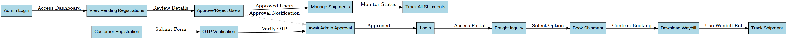

# FreightForge - Railway Freight Booking Portal

Welcome to the **FreightForge** user guide. This document provides a comprehensive overview of the FreightForge Streamlit application, including its features, workflows, and usage instructions.

---

## Table of Contents

1. [Overview](#overview)
2. [Features](#features)
3. [Application Workflow](#application-workflow)
4. [User Interface Guide](#user-interface-guide)
5. [Waybill and Shipment Tracking](#waybill-and-shipment-tracking)
6. [Admin Panel](#admin-panel)
7. [Data Storage](#data-storage)
8. [Demo Users](#demo-users)

---

## Overview

**FreightForge** is a prototype web application built using Streamlit that simulates a railway freight booking system for bulk grain shipments. It allows logistics managers to register, inquire about freight rates, book shipments, generate waybills, and track shipments in real-time.

---

## Features

- User registration with OTP verification and document upload
- Admin approval system for new users
- Freight rate inquiry and booking
- Waybill generation and download
- Real-time shipment tracking
- Admin panel for user approvals
- Persistent data storage using CSV files

---

## Application Workflow

The following diagram illustrates the workflow of the FreightForge application:

- Generic workflow 

  

- Persona wise - Workflow 

---

## User Interface Guide

### 1. Welcome Page

- Introduction to the FreightForge system
- Overview of features and demo instructions

### 2. Register & Login

#### Register Tab
- Fill in business and contact details
- Upload business registration document
- Receive OTP (simulated) and verify
- Submit registration for admin approval

#### Login Tab
- Enter username and password to log in
- Only approved users can access the system

#### Admin Approvals Tab
- Admin can approve or reject pending registrations

### 3. Freight Inquiry & Booking

- View recent shipments
- Enter shipment details (goods type, quantity, origin, destination)
- Get estimated freight charges
- Select train/wagon option
- Book shipment and generate waybill
- Download waybill as a text file

### 4. Track Shipment (Waybill)

- Enter waybill reference to track shipment
- View shipment status, ETA, and tracking history
- Simulate delivery to update status

---

## Waybill and Shipment Tracking

- Each booking generates a unique waybill reference
- Waybill includes shipment details, charges, and ETA
- Tracking history shows status updates (e.g., Booking Confirmed, In Transit, Delivered)

---

## Admin Panel

- Admin user (`admin`) can view and approve pending registrations
- Approved users are moved from `pending_users.csv` to `users.csv`

---

## Data Storage

The application uses CSV files for persistent storage:

- `users.csv`: Approved users
- `pending_users.csv`: Pending registrations
- `shipments.csv`: Shipment bookings
- `waybills.csv`: Waybill and tracking data

---

## Demo Users

The app includes preloaded demo users:

- **Admin**
  - Username: `admin`
  - Password: `admin`

- **Customer1**
  - Username: `Customer1`
  - Password: `Customer1`

- **Customer2**
  - Username: `Customer2`
  - Password: `Customer2`

---

## Notes

- OTP and email functionalities are simulated
- All data is stored locally in CSV files
- This is a prototype for demonstration purposes

---
